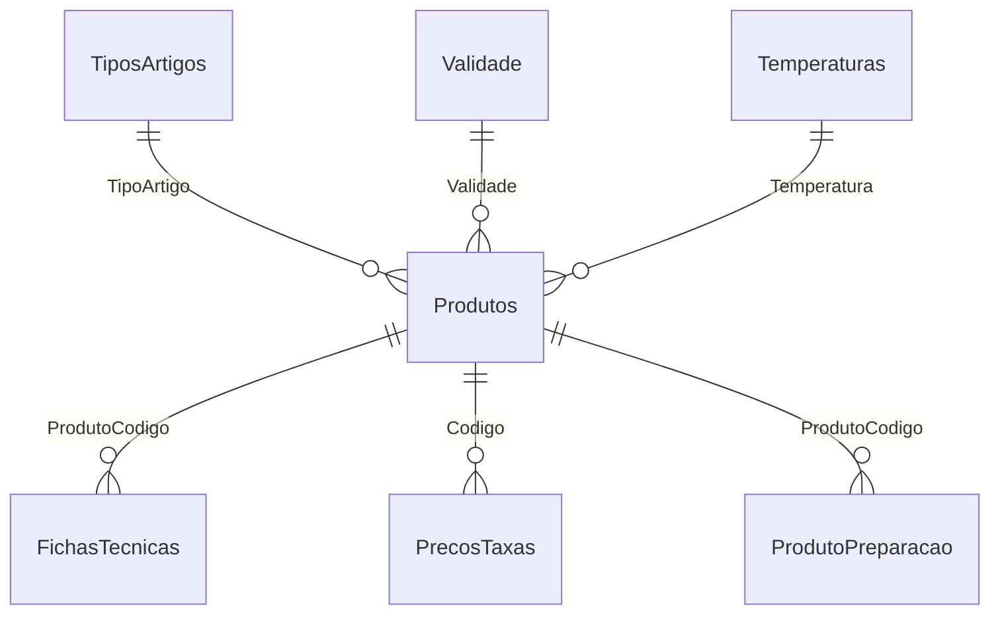

# Esquema de base de dados e datasets auxiliares

> **Nota**: Apenas os campos listados abaixo são aceites; cabeçalhos diferentes serão ignorados.

## Tabelas principais

### `Produtos`
| Campo | Descrição |
|-------|-----------|
| **Codigo** | Código do produto (PK) |
| Produto | Nome do produto |
| Familia | Família do produto |
| SubFamilia | Subfamília |
| AfetaStk | Afeta stock |
| Menu | Indicação de menu |
| CodBarras | Código de barras |
| TipoMercad | Tipo de mercado |
| TipoVenda | Tipo de venda |
| TipoProducao | Tipo de produção |
| TipoGener | Tipo genérico |
| UnStockVMPG | Unidades de stock |
| UnVendaVMV | Unidades de venda |
| UnInvVMMMPG | Unidades de inventário |
| UnProduFtPV | Unidades para ficha técnica |
| CodAuxiliar | Código auxiliar |
| CodAuxiliar2 | Código auxiliar 2 |
| PCU | Peso/custo unitário |
| PCM | Peso/custo médio |
| Descontinuado | Indicador de descontinuação |
| DispLojas | Disponibilidade nas lojas |
| TipoArtigo | Referência a `TiposArtigos` |
| Validade | Referência a `Validade` |
| Temperatura | Referência a `Temperaturas` |

### `FichasTecnicas`
| Campo | Descrição |
|-------|-----------|
| **FamiliaSubfamilia** | Família > Subfamília |
| **ProdutoCodigo** | Código do produto |
| ProdutoNome | Nome do produto |
| ComponenteCodigo | Código do componente |
| ComponenteNome | Nome do componente |
| Qtd | Quantidade |
| Unidade | Unidade de medida |
| Ppu | Preço por unidade |
| Preco | Preço total |
| Peso | Peso |
| Ordem | Mantém a ordem dos componentes |

### `PrecosTaxas`
| Campo | Descrição |
|-------|-----------|
| **Codigo** | Código do produto |
| **Loja** | Loja (chave composta) |
| Preco1 | Preço PVP1 |
| Preco2 | Preço PVP2 |
| Preco3 | Preço PVP3 |
| Preco4 | Preço PVP4 |
| Preco5 | Preço PVP5 |
| Iva1_2 | Taxa de IVA |
| IsencaoIva | Indicação de isenção |
| NomeProdVenda | Nome para venda |
| Familia | Família do produto |
| SubFamilia | Subfamília |
| Ativo | Indicador de ativo |

### `Uploads`
| Campo | Descrição |
|-------|-----------|
| **Id** | Identificador do upload |
| Filename | Nome do ficheiro |
| Content | Conteúdo |
| UploadedAt | Data de envio |

### `Config`
| Campo | Descrição |
|-------|-----------|
| **Key** | Chave de configuração |
| Value | Valor associado |

## Tabelas auxiliares

### `Alergenios`
| Campo | Descrição |
|-------|-----------|
| **Id** | Identificador |
| Nome | Nome do alergénio |
| Ativo | Indicador de ativo |

### `TiposArtigos`
| Campo | Descrição |
|-------|-----------|
| **Cod** | Código do tipo |
| Descricao | Descrição |
| Ativo | Indicador de ativo |

### `Validade`
| Campo | Descrição |
|-------|-----------|
| **Cod** | Código de validade |
| Descricao | Ex.: “24h”, “48h” |
| Ativo | Indicador de ativo |

### `Temperaturas`
| Campo | Descrição |
|-------|-----------|
| **Cod** | Código de temperatura |
| Descricao | Ex.: “Quente”, “Frio” |
| Ativo | Indicador de ativo |

### `ProdutoPreparacao`
| Campo | Descrição |
|-------|-----------|
| **ProdutoCodigo** | Referência a `Produtos` (PK) |
| Html | Instruções de preparação |

## Relações principais

