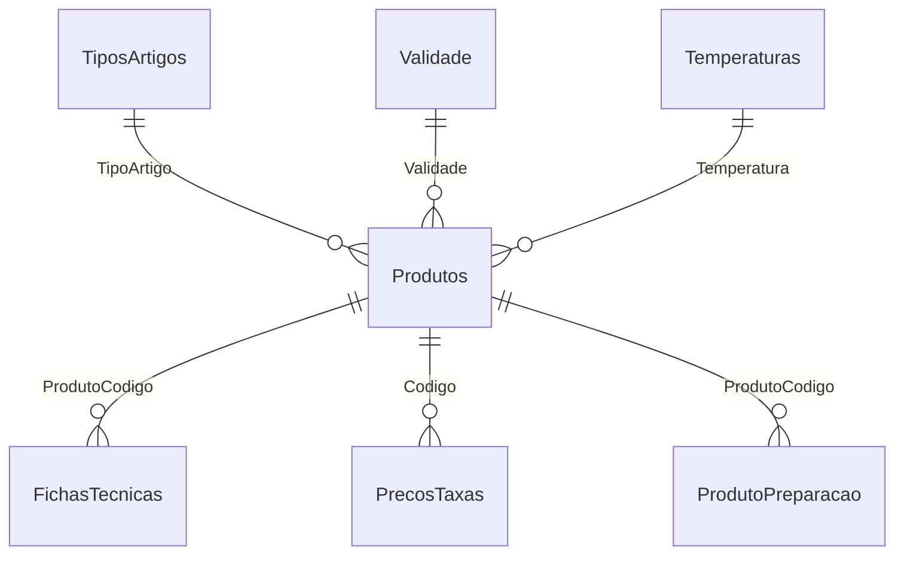

# 1. Esquema de base de dados e datasets auxiliares

## Tabelas principais

### `Produtos`
| Campo | Descrição |
|---|---|
| **Codigo** | Código do produto (PK) |
| Produto | Nome do produto |
| Familia | Família do produto |
| SubFamilia | Subfamília |
| AfetaStk | Afeta stock |
| Menu | Indicação de menu |
| CodBarras | Código de barras |
| TipoMercad | Tipo de mercado |
| TipoVenda | Tipo de venda |
| TipoProducao | Tipo de produção |
| TipoGener | Tipo genérico |
| UnStockVMPG | Unidades de stock |
| UnVendaVMV | Unidades de venda |
| UnInvVMMMPG | Unidades de inventário |
| UnProduFtPV | Unidades para ficha técnica |
| CodAuxiliar | Código auxiliar |
| CodAuxiliar2 | Código auxiliar 2 |
| PCU | Peso/custo unitário |
| PCM | Peso/custo médio |
| Descontinuado | Indicador de descontinuação |
| DispLojas | Disponibilidade nas lojas |
| TipoArtigo | Ref. a `TiposArtigos` |
| Validade | Ref. a `Validade` |
| Temperatura | Ref. a `Temperaturas` |

### `FichasTecnicas`
| Campo | Descrição |
|---|---|
| **FamiliaSubfamilia** | Família > Subfamília |
| **ProdutoCodigo** | Código do produto |
| ProdutoNome | Nome do produto |
| ComponenteCodigo | Código do componente |
| ComponenteNome | Nome do componente |
| Qtd | Quantidade |
| Unidade | Unidade de medida |
| Ppu | Preço por unidade |
| Preco | Preço total |
| Peso | Peso |
| Ordem | Mantém a ordem dos componentes |

### `PrecosTaxas`
| Campo | Descrição |
|---|---|
| **Codigo** | Código do produto |
| **Loja** | Loja (chave composta) |
| Preco1 | Preço PVP1 |
| Preco2 | Preço PVP2 |
| Preco3 | Preço PVP3 |
| Preco4 | Preço PVP4 |
| Preco5 | Preço PVP5 |
| Iva1 | Taxa de IVA principal |
| Iva2 | Segunda taxa de IVA |
| IsencaoIva | Indicação de isenção |
| NomeProdVenda | Nome para venda |
| Familia | Família |
| SubFamilia | Subfamília |
| Ativo | Indicador de ativo |

### `Uploads`
| Campo | Descrição |
|---|---|
| **Id** | Identificador do upload |
| Filename | Nome do ficheiro |
| Content | Conteúdo |
| UploadedAt | Data de envio |

### `Config`
| Campo | Descrição |
|---|---|
| **Key** | Chave de configuração |
| Value | Valor associado |

## Tabelas auxiliares

### `Alergenios`
| Campo | Descrição |
|---|---|
| **Id** | Identificador |
| Nome | Nome do alergénio em português |
| NomeIngles | Nome do alergénio em inglês |
| Descricao | Descrição detalhada |
| Exemplos | Exemplos de ocorrência |
| Notas | Observações adicionais |
| Ativo | Indicador de ativo |

> Nota: o ``DataStore`` exige a presença da tabela ``Alergenios`` com as colunas
> ``Id`` e ``Nome`` para garantir que as sincronizações de alergénios funcionem.

### `TiposArtigos`
| Campo | Descrição |
|---|---|
| **Cod** | Código do tipo |
| Descricao | Descrição |
| Ativo | Indicador de ativo |

### `Validade`
| Campo | Descrição |
|---|---|
| **Cod** | Código de validade |
| Descricao | Ex.: "24h", "48h" |
| Ativo | Indicador de ativo |

### `Temperaturas`
| Campo | Descrição |
|---|---|
| **Cod** | Código de temperatura |
| Descricao | Ex.: "Quente", "Frio" |
| Ativo | Indicador de ativo |

### `ProdutoPreparacao`
| Campo | Descrição |
|---|---|
| **ProdutoCodigo** | Ref. a `Produtos` (PK) |
| Html | Instruções de preparação |

## Relações principais

---

# 2. Mapeamento Excel → base de dados e formatos

## Ficheiros de importação
- `FichasTecnicas_base.xlsx`
- `PreçosTaxas_base.xlsx`
- `Produtos_Base.xlsx`

Após importação, os ficheiros são arquivados em `imports/history` e registados em `Uploads`.

## Normalização de cabeçalhos
- Remoção de acentos/pontuação

> **Nota**: Apenas os campos listados abaixo são aceites; cabeçalhos diferentes serão ignorados.

## Tabela `Produtos_Base.xlsx`
| Cabeçalho Excel | Coluna BD |
|---|---|
| Codigo | Codigo |
| Produto | Produto |
| Familia | Familia |
| SubFamilia | SubFamilia |
| AfetaStk | AfetaStk |
| Menu | Menu |
| CodBarras | CodBarras |
| TipoMercad | TipoMercad |
| TipoVenda | TipoVenda |
| TipoProducao | TipoProducao |
| TipoGener | TipoGener |
| UnStockVMPG | UnStockVMPG |
| UnVendaVMV | UnVendaVMV |
| UnInvVMMMPG | UnInvVMMMPG |
| UnProduFtPV | UnProduFtPV |
| CodAuxiliar | CodAuxiliar |
| CodAuxiliar2 | CodAuxiliar2 |
| PCU | PCU |
| PCM | PCM |
| Descontinuado | Descontinuado |
| DispLojas | DispLojas |

## Tabela `FichasTecnicas_base.xlsx`
| Cabeçalho Excel | Coluna BD |
|---|---|
| FamiliaSubfamilia | FamiliaSubfamilia |
| ProdutoCodigo | ProdutoCodigo |
| ProdutoNome | ProdutoNome |
| ComponenteCodigo | ComponenteCodigo |
| ComponenteNome | ComponenteNome |
| Qtd | Qtd |
| Unidade | Unidade |
| Ppu | Ppu |
| Preco | Preco |
| Peso | Peso |
| Ordem | Ordem |

## Tabela `PreçosTaxas_base.xlsx`
| Cabeçalho Excel | Coluna BD |
|---|---|
| Codigo | Codigo |
| Loja | Loja |
| Preco1 | Preco1 |
| Preco2 | Preco2 |
| Preco3 | Preco3 |
| Preco4 | Preco4 |
| Preco5 | Preco5 |
| Iva1 | Iva1 |
| Iva2 | Iva2 |
| IsencaoIva | IsencaoIva |
| NomeProdVenda | NomeProdVenda |
| Familia | Familia |
| SubFamilia | SubFamilia |
| Ativo | Ativo |

## Observações de importação
- Campos numéricos (preços, quantidades, impostos) são convertidos para `decimal`.  
- Importações permitem *upsert* de produtos ou fichas técnicas existentes.

---

# 3. Resumo
- **Esquema**: Base SQLite com tabelas principais (`Produtos`, `FichasTecnicas`, `PrecosTaxas`, `Uploads`, `Config`), auxiliares (`Alergenios`, `TiposArtigos`, `Validade`, `Temperaturas`) e `ProdutoPreparacao`.  
- **Integração Excel**: Três ficheiros `.xlsx` alimentam as tabelas; cabeçalhos normalizados e ficheiros arquivados.  
- **Mapeamentos**: Tabelas anteriores mostram correspondência de cabeçalhos Excel ↔ colunas da base de dados.
