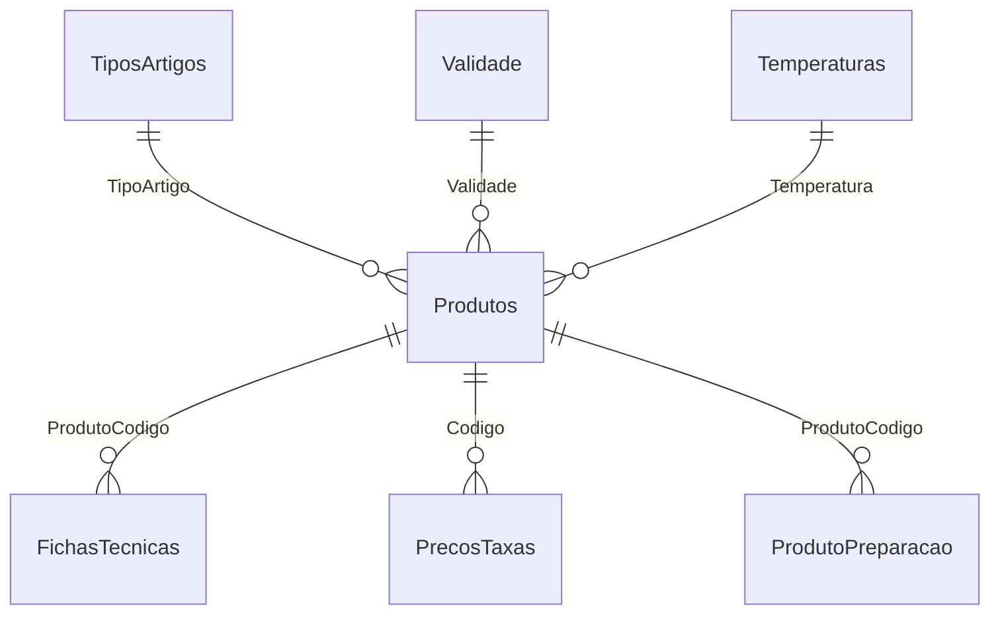

# 1. Esquema de base de dados e datasets auxiliares

## Tabelas principais

### `Produtos`
| Campo | Descrição |
|---|---|
| **Codigo** | Código do produto (PK) |
| Produto | Nome do produto |
| Familia | Família do produto |
| SubFamilia | Subfamília |
| AfetaStk | Afeta stock |
| Menu | Indicação de menu |
| CodBarras | Código de barras |
| TipoMercad | Tipo de mercado |
| TipoVenda | Tipo de venda |
| TipoProducao | Tipo de produção |
| TipoGener | Tipo genérico |
| UnStockVMPG | Unidades de stock |
| UnVendaVMV | Unidades de venda |
| UnInvVMMMPG | Unidades de inventário |
| UnProduFtPV | Unidades para ficha técnica |
| CodAuxiliar | Código auxiliar |
| CodAuxiliar2 | Código auxiliar 2 |
| PCU | Peso/custo unitário |
| PCM | Peso/custo médio |
| Descontinuado | Indicador de descontinuação |
| DispLojas | Disponibilidade nas lojas |
| TipoArtigo | Ref. a `TiposArtigos` |
| Validade | Ref. a `Validade` |
| Temperatura | Ref. a `Temperaturas` |

### `FichasTecnicas`
| Campo | Descrição |
|---|---|
| **FamiliaSubfamilia** | Família > Subfamília |
| **ProdutoCodigo** | Código do produto |
| ProdutoNome | Nome do produto |
| ComponenteCodigo | Código do componente |
| ComponenteNome | Nome do componente |
| Qtd | Quantidade |
| Unidade | Unidade de medida |
| Ppu | Preço por unidade |
| Preco | Preço total |
| Peso | Peso |

### `PrecosTaxas`
| Campo | Descrição |
|---|---|
| **Codigo** | Código do produto |
| **Loja** | Loja (chave composta) |
| Preco1–5 | Preços por loja |
| Iva1–2 | Taxas de IVA |
| IsencaoIva | Indicação de isenção |
| NomeProdVenda | Nome para venda |
| Familia | Família |
| SubFamilia | Subfamília |
| Ativo | Indicador de ativo |

### `Uploads`
| Campo | Descrição |
|---|---|
| **Id** | Identificador do upload |
| Filename | Nome do ficheiro |
| Content | Conteúdo |
| UploadedAt | Data de envio |

### `Config`
| Campo | Descrição |
|---|---|
| **Key** | Chave de configuração |
| Value | Valor associado |

## Tabelas auxiliares

### `Alergenios`
| Campo | Descrição |
|---|---|
| **Id** | Identificador |
| Nome | Nome do alergénio |
| Ativo | Indicador de ativo |

### `TiposArtigos`
| Campo | Descrição |
|---|---|
| **Cod** | Código do tipo |
| Descricao | Descrição |
| Ativo | Indicador de ativo |

### `Validade`
| Campo | Descrição |
|---|---|
| **Cod** | Código de validade |
| Descricao | Ex.: "24h", "48h" |
| Ativo | Indicador de ativo |

### `Temperaturas`
| Campo | Descrição |
|---|---|
| **Cod** | Código de temperatura |
| Descricao | Ex.: "Quente", "Frio" |
| Ativo | Indicador de ativo |

### `ProdutoPreparacao`
| Campo | Descrição |
|---|---|
| **ProdutoCodigo** | Ref. a `Produtos` (PK) |
| Html | Instruções de preparação |

## Relações principais

---

# 2. Mapeamento Excel → base de dados e formatos

## Ficheiros de importação
- `FichasTecnicas_base.xlsx`
- `PreçosTaxas_base.xlsx`
- `Produtos_Base.xlsx`

Após importação, os ficheiros são arquivados em `imports/history` e registados em `Uploads`.

## Normalização de cabeçalhos
- Remoção de acentos/pontuação  
- Aliases: “Prod Venda” → `Codigo`, “Preço 1” → `Preco1`, etc.  
- “Preço n g” mapeado para colunas específicas de gramas em `Produtos`

## Tabela `Produtos_Base.xlsx`
| Cabeçalho (exemplo) | Coluna BD |
|---|---|
| Código | Codigo |
| Produto | Produto |
| Família | Familia |
| Sub Família | SubFamilia |
| Afeta Stk | AfetaStk |
| Menu | Menu |
| Cod Barras | CodBarras |
| Tipo Mercad | TipoMercad |
| Tipo Venda | TipoVenda |
| Tipo Produção | TipoProducao |
| Tipo Gener | TipoGener |
| Un Stock (V,M,P,G) | UnStockVMPG |
| Un Venda (V+M,V) | UnVendaVMV |
| Un Inv (V+M,M,P,G) | UnInvVMMMPG |
| Un Produ / FT (P,V) | UnProduFtPV |
| Cod. Auxiliar | CodAuxiliar |
| Cod. Auxiliar 2 | CodAuxiliar2 |
| PCU | PCU |
| PCM | PCM |
| Descontinuado | Descontinuado |
| Disp. Lojas | DispLojas |

## Tabela `FichasTecnicas_base.xlsx`
| Cabeçalho (exemplo) | Coluna BD |
|---|---|
| Família > Subfamília | FamiliaSubfamilia |
| Produto - Código | ProdutoCodigo |
| Produto - Nome | ProdutoNome |
| Componente - Código | ComponenteCodigo |
| Componente - Nome | ComponenteNome |
| Qtd. | Qtd |
| Unidade | Unidade |
| PPU | Ppu |
| Preço | Preco |
| Peso | Peso |

## Tabela `PreçosTaxas_base.xlsx`
| Cabeçalho (exemplo) | Coluna BD |
|---|---|
| Prod Venda | Codigo |
| Loja | Loja |
| Ativo | Ativo |
| Preço 1–5 | Preco1–Preco5 |
| Iva 1 | Iva1 |
| Iva 2 | Iva2 |
| Isenção IVA | IsencaoIva |
| Nome prod venda (não necessário p/ importar) | NomeProdVenda |
| Familia (não necessário p/ importar) | Familia |
| Sub-Familia (não necessário p/ importar) | SubFamilia |

## Observações de importação
- Campos numéricos (preços, quantidades, impostos) são convertidos para `decimal`.  
- Importações permitem *upsert* de produtos ou fichas técnicas existentes.

---

# 3. Resumo
- **Esquema**: Base SQLite com tabelas principais (`Produtos`, `FichasTecnicas`, `PrecosTaxas`, `Uploads`, `Config`), auxiliares (`Alergenios`, `TiposArtigos`, `Validade`, `Temperaturas`) e `ProdutoPreparacao`.  
- **Integração Excel**: Três ficheiros `.xlsx` alimentam as tabelas; cabeçalhos normalizados e ficheiros arquivados.  
- **Mapeamentos**: Tabelas anteriores mostram correspondência de cabeçalhos Excel ↔ colunas da base de dados.
