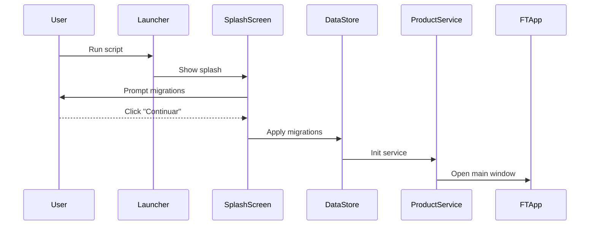

# Application Workflows

## 1. Login / application launch
**Flow**

```
User → FTApp launcher → SplashScreen (click to continue) → DataStore (migrations) → ProductService → FTApp main window
```



1. User starts `bwb-fichas_tecnicas.py`.
2. `QApplication` and theme are created.
3. `SplashScreen` exibe mensagem sobre migrações pendentes e aguarda o clique em "Continuar".
4. Ao clicar, `DataStore` liga a `databases/ftv.db`, criando-a se necessário, e aplica as migrações antes de prosseguir.
5. `ProductService` wraps the datastore; the main `FTApp` window is shown.

**Agent responsibilities & data**

| Agent | Responsibility | Data exchanged |
|-------|----------------|----------------|
| Migration Agent | Checks for pending migrations before DataStore initialization and applies them | SQLite schema metadata, migration SQL files |
| Backup Agent | May be invoked before migrations (not automatic) | Database file |
| UI (implicit login) | Confirms continuation and displays main window | User choice ("Continuar"/"Sair") |

---

## 2. Technical sheet creation
**Flow**

```
Excel files → Data Import Agent → DataStore ↔ ProductService → FTApp → user edits/creates sheet
```

1. Data Import Agent loads `FichasTecnicas_base.xlsx`, `Produtos_Base.xlsx`, etc., into SQLite via `ProductService.import_from_excel`.
2. Schema Maintenance Agent aligns table columns with spreadsheet headers.
3. When a product is selected in the UI, `ProductService.list_fichas_tecnicas` pulls ingredient rows from `DataStore`.
4. Ingredient dataclasses are displayed/edited in the `FTApp` table model; saving would persist changes via datastore methods.

**Key code points**

- Import trigger: `ProductService.import_from_excel()`
- Fetching sheet rows: `ProductService.list_fichas_tecnicas()` uses `DataStore.get_ingredientes()`

**Notas sobre impressão**

- A impressão da **Ficha Técnica de Gestão** (sinónimos: “FT Gestão”, “FT's Gestão”, “Ficha de Gestão”) privilegia a visão de custos e exclui os blocos **B4** e **B5**.
- A impressão da **Ficha Técnica Operacional** (sinónimos: “FT Operacional”, “FT's Operacional”, “Ficha Operacional”, “FTs Operacionais”) centra-se no processo produtivo, omitindo o bloco **B3** e a tag **B1.C1.A.3** (“Preços de Venda”).

**Agent responsibilities & data**

| Agent | Responsibility | Data exchanged |
|-------|----------------|----------------|
| Data Import Agent | Validate spreadsheets and insert/update rows | Excel files → `databases/ftv.db` |
| Schema Maintenance Agent | Ensure DB schema matches Excel headers | Column names and types |
| Backup Agent | Optionally safeguard DB before large imports | Database file |
| UI/Service | Present technical-sheet rows and relay user edits | Ingredient name, quantity, unit, PPU, total |

---

## 3. Cost calculation
**Flow**

```
User edits ingredients → FTApp → ProductService.calculate_cost → total displayed
```

1. UI loads a product's ingredients and immediately shows total cost.
2. When ingredient data changes, `_update_costs_from_table` re-calls `ProductService.calculate_cost`.
3. `calculate_cost` sums `Ingredient.total` values or `ppu * quantity` for each row.

**Key code points**

- Display cost when loading a product
- Recalculate on edits
- Service logic & helper function

**Agent responsibilities & data**

| Agent | Responsibility | Data exchanged |
|-------|----------------|----------------|
| ProductService | Iterates over `Ingredient` dataclasses and computes total | Quantity, unit price, total per ingredient |
| UI | Triggers recalculation and displays formatted result | Formatted total cost |
| Backup Agent (optional) | Backup before major edits | Database file |

---
